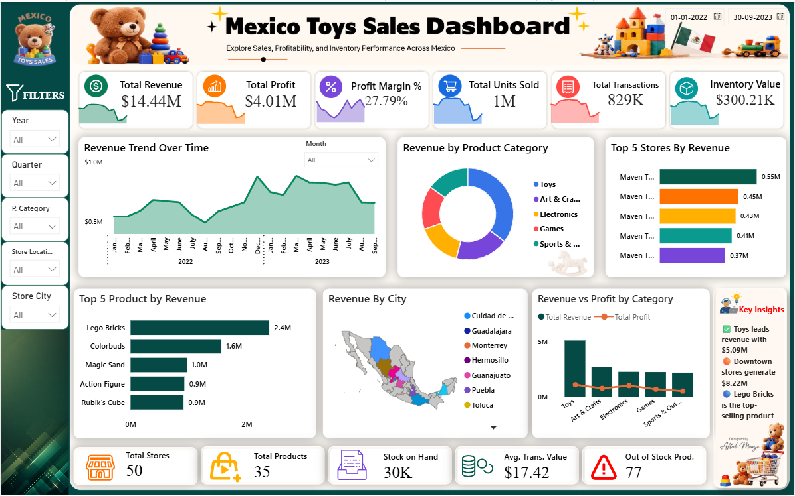

# FUTURE_DS_01 — Mexico Toy Sales Analysis

## Project Overview

This project analyzes the sales, profitability, product performance, store performance, and inventory position of Maven Toys, a fictional toy-store chain operating across Mexico.

The project was completed using Excel, Python, and Power BI to clean the data, calculate business-focused KPIs, identify performance trends, and present actionable insights through an interactive dashboard.

## Dashboard Preview



## Project Objectives

- Analyze overall sales and profitability
- Identify the best-performing products and categories
- Compare store, city, and location performance
- Examine monthly revenue trends
- Analyze current inventory levels
- Identify out-of-stock products
- Generate business-focused recommendations

## Key KPIs

| KPI | Result |
|---|---:|
| Total Revenue | $14.44M |
| Total Profit | $4.01M |
| Profit Margin | 27.79% |
| Units Sold | 1.09M |
| Total Transactions | 829.26K |
| Inventory Value | $300.21K |
| Out-of-Stock Products | 77 |

## Key Insights

- Toys generated the highest category revenue at approximately $5.09M.
- Downtown store locations generated approximately $8.22M in revenue.
- Lego Bricks was the highest-revenue product.
- Colorbuds was one of the most profitable products.
- Ciudad de Mexico was the strongest-performing city.
- The business had 77 out-of-stock store-product combinations.
- Monthly revenue showed visible seasonal changes across 2022 and 2023.

## Tools Used

- Microsoft Excel
- Power Query
- Python
- Pandas
- NumPy
- Matplotlib
- Power BI
- DAX

## Data Cleaning and Preparation

The following validation and cleaning steps were performed:

- Checked data types
- Checked missing values
- Checked duplicate records
- Converted date columns
- Standardized product and store information
- Validated Store IDs and Product IDs
- Checked invalid and negative values
- Created revenue, cost, and profit calculations
- Created a calendar table for time-based analysis

## Data Model

The Power BI report follows a star-schema structure containing:

- Sales fact table
- Inventory fact table
- Products dimension
- Stores dimension
- Calendar dimension

## Important DAX Measures

### Total Revenue

```DAX
Total Revenue =
SUMX(
    Sales,
    Sales[Units] * RELATED(Products[Product_Price])
)
```

### Total Cost

```DAX
Total Cost =
SUMX(
    Sales,
    Sales[Units] * RELATED(Products[Product_Cost])
)
```

### Total Profit

```DAX
Total Profit =
[Total Revenue] - [Total Cost]
```

### Profit Margin

```DAX
Profit Margin % =
DIVIDE(
    [Total Profit],
    [Total Revenue],
    0
)
```

### Total Units Sold

```DAX
Total Units Sold =
SUM(Sales[Units])
```

### Total Transactions

```DAX
Total Transactions =
DISTINCTCOUNT(Sales[Sale_ID])
```

## Dashboard Features

- Revenue, profit, margin, units, and transaction KPI cards
- Monthly revenue trend
- Revenue by product category
- Top five stores by revenue
- Top five products by revenue
- Revenue by city
- Revenue versus profit by category
- Inventory value
- Stock-on-hand analysis
- Out-of-stock product indicator
- Interactive slicers for Year, Quarter, Product Category, Store Location, and Store City

## Business Recommendations

- Prioritize restocking of high-demand products that are currently out of stock.
- Maintain sufficient inventory for Lego Bricks and other top-selling products.
- Review stock allocation across low-performing stores.
- Focus marketing and expansion efforts on strong-performing cities and Downtown locations.
- Monitor product profitability instead of relying only on revenue.
- Use promotions or stock transfers for slow-moving inventory.

## Repository Structure

```text
FUTURE_DS_01/
│
├── Data/
│   └── Clean Maven Toys Data.xlsx
│
├── PowerBI/
│   └── Mexico Toy Sales Dashboard.pbix
│
├── Images/
│   └── Dashboard_Preview.png
│
├── README.md
└── .gitignore
```

## Author

**Designed and developed by Aftab Monye**

Data Analyst

LinkedIn: https://www.linkedin.com/in/aftab-monye/
